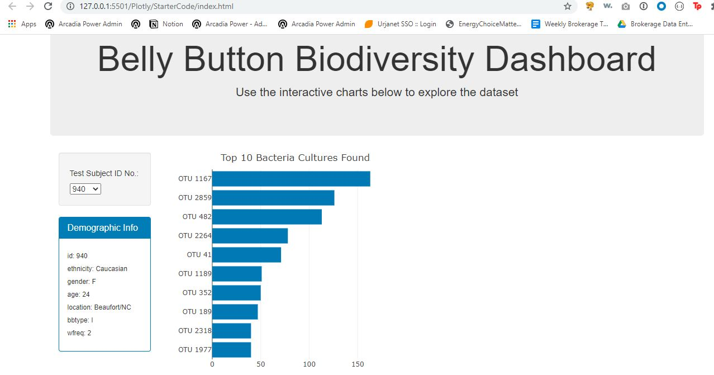
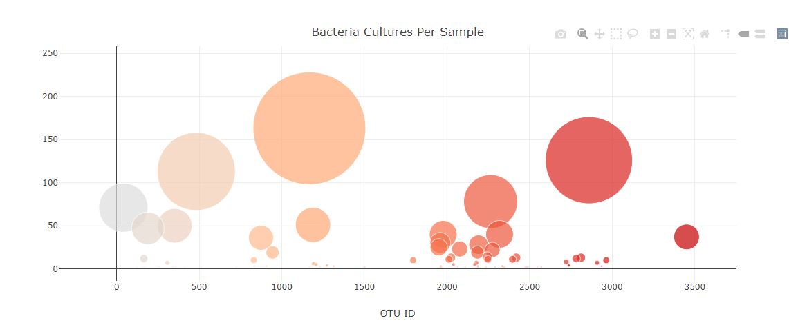

# Plotly

In this project, I built an interactive dashboard to explore the [Belly Button Biodiversity dataset](http://robdunnlab.com/projects/belly-button-biodiversity/), 
which catalogs the microbes that colonize human navels.

The dataset reveals that a small handful of microbial species (also called operational taxonomic units, or OTUs, in the study) were present in more than 70% of people, 
while the rest were relatively rare.

## Overview

1. Used the D3 library to read in `samples.json`.

2. Created a horizontal bar chart with a dropdown menu to display the top 10 OTUs found in that individual.

3. Created a bubble chart that displays each sample.

4. Displayed the sample metadata, i.e., an individual's demographic information.

5. Displayed each key-value pair from the metadata JSON object somewhere on the page.

6. Updated all of the plots any time that a new sample is selected.

## Screenshots

Below is a screenshot of the belly button bar chart on the webpage showing top 10 bacteria cultures per sample. The reason this data was visualized using an inversed bar chart was because I wanted to highlight the OTU ids and because there is a limited range of number of bacteria cultures among the top ten samples, I figured I would put the OTU ids on the y axis. 

Below is a screenshot of the bubble chart on the webpage showing the number of bacteria cultures per otu id. The reason I used a bubble chart to display this data was because I wanted to highlight both the number of bacteria cultures found and variability in amount of bacteria cultures.

